```mermaid
graph TD
    Y["Container Y SBOM<br/>━━━━━━━━━━━━━━<br/>📦 my-binary<br/>📦 rpm-1<br/>📦 rpm-2<br/>📦 rpm-3<br/>📦 rpm-4<br/>📦 rpm-5"]

    style Y fill:#ffcccc
```

```mermaid
graph TD
    Y["Container Y SBOM<br/>━━━━━━━━━━━━━━<br/>📦 my-binary"]
    X["Container X SBOM<br/>━━━━━━━━━━━━━━<br/>📦 rpm-1<br/>📦 rpm-2<br/>📦 rpm-3<br/>📦 rpm-4<br/>📦 rpm-5"]

    Y -->|DESCENDANT_OF| X
    Y -->|CONTAINS| my-binary["my-binary"]
    X -->|CONTAINS| rpms["rpm-1, rpm-2,<br/>rpm-3, rpm-4, rpm-5"]

    style Y fill:#ccffcc
    style X fill:#ccffcc
    style my-binary fill:#e6f3ff
    style rpms fill:#e6f3ff
```

```mermaid
graph TD
    Z["Container Z SBOM<br/>━━━━━━━━━━━━━━<br/>📦 my-app<br/>📦 golang-compiler<br/>📦 build-tools<br/>📦 my-binary<br/>📦 rpm-1<br/>📦 rpm-2<br/>📦 rpm-3"]

    style Z fill:#ffcccc
```

# Contextual SBOMs

## The Problem: Flat SBOMs Hide Inheritance

Current SBOM generation tools like syft scan an entire artifact (container image, AI model, etc.) and list all components found, without distinguishing between:
- Components added at the current build layer
- Components inherited from parent artifacts

This creates several issues:
1. **Duplication**: The same components appear in multiple SBOMs across the inheritance chain
2. **Lost provenance**: No way to tell which layer introduced which component
3. **Storage bloat**: Especially problematic for deep hierarchies (AI models can have 5+ levels)
4. **False positives**: Inherited content triggers redundant vulnerability alerts

### Why Not Defer to Downstream Stitching?

One alternative is to have providers reference their immediate parent SBOMs and let downstream systems like GUAC stitch together the complete view. However, this only works if providers are willing to distribute SBOMs for **all parent artifacts transitively**.

**In practice, providers often only want to distribute their final artifact** without exposing the entire build chain. Reasons include:
- **Support surface area**: Distributing parent artifacts implies support obligations
- **Proprietary bases**: Parent images/models may be internal-only or licensed differently
- **Deployment simplicity**: Consumers just want the final artifact, not the entire build toolchain

This constraint is especially acute for **deep AI model hierarchies** where distributing 5-6 levels of parent artifacts may be impractical or undesirable.

## The Solution: Hierarchical Relationships

**Contextual SBOMs** embed parent artifact content within the child SBOM using SPDX/CycloneDX relationship types:
- `DESCENDANT_OF`: Links to parent artifact
- `CONTAINS`: Lists components at each level

This approach allows:
- ✅ Single artifact distribution (just the final child)
- ✅ Complete SBOM information (all components with provenance)
- ✅ No requirement to distribute or support parent artifacts separately
- ✅ Clear component provenance (which layer introduced what)

---

## Examples

### Example 1: Simple Container Inheritance

Container image Y builds on base image X.

#### Problem: Flat SBOM

**Issues**:
- No distinction between `my-binary` (added in Y) and RPMs (from X)
- If X's SBOM exists separately, components are duplicated
- Consumers can't tell provenance of each component

#### Solution: Contextual SBOM

**Benefits**:
| Metric | Flat SBOM | Contextual SBOM |
|--------|-----------|-----------------|
| Components in Y's SBOM | 6 | 1 (+ reference to X) |
| Provenance clarity | None | Clear (Y adds my-binary) |
| Storage if both distributed | ~2x duplication | No duplication |

---

### Example 2: Multi-stage Build with Builder Image

Container Z uses a builder image for compilation but only ships the runtime result, inheriting from Y.

#### Problem: Flat SBOM

**Issues**:
- Builder tools (golang-compiler, build-tools) listed as if they're shipped
- Can't distinguish build-time from runtime dependencies
- Misleading for security scanning (build tools aren't in final image)

#### Solution: Contextual SBOM

```mermaid
graph TD
    Z["Container Z SBOM<br/>━━━━━━━━━━━━━━<br/>📦 my-app"]
    Y["Container Y SBOM<br/>━━━━━━━━━━━━━━<br/>📦 my-binary"]
    Builder["Builder Image<br/>━━━━━━━━━━━━━━<br/>📦 golang-compiler<br/>📦 build-tools"]
    X["Container X SBOM<br/>━━━━━━━━━━━━━━<br/>📦 rpm-1, rpm-2, rpm-3"]

    Z -->|DESCENDANT_OF| Y
    Z -->|BUILD_TOOL_OF| Builder
    Y -->|DESCENDANT_OF| X

    Z -->|CONTAINS| myapp["my-app"]
    Y -->|CONTAINS| mybinary["my-binary"]
    Builder -->|CONTAINS| buildtools["golang-compiler<br/>build-tools"]
    X -->|CONTAINS| rpms["rpm-1, rpm-2, rpm-3"]

    style Z fill:#ccffcc
    style Y fill:#ccffcc
    style Builder fill:#fff3cd
    style X fill:#ccffcc
    style myapp fill:#e6f3ff
    style mybinary fill:#e6f3ff
    style buildtools fill:#fff9e6
    style rpms fill:#e6f3ff
```

**Key difference**: `BUILD_TOOL_OF` relationship means builder content is **not copied forward** into Z's shipped SBOM—it's documented but marked as build-time only.

**Benefits**:
| Metric | Flat SBOM | Contextual SBOM |
|--------|-----------|-----------------|
| Components in Z's SBOM | 7 | 1 (+ references) |
| Build vs runtime clarity | None | Explicit via relationships |
| False vulnerability alerts | High (build tools included) | Low (build tools excluded) |

---

### Example 3: Deep AI Model Hierarchy

A modelcar is a container image (OCI format) that packages an AI model for deployment. The modelcar inherits from a container base image and contains the model artifact. The model itself has a deep inheritance chain through fine-tuning and foundation models. This demonstrates the **depth problem** where AI artifacts commonly have 7+ levels of inheritance.

#### Problem: Flat SBOM

```mermaid
graph TD
    Modelcar["Modelcar SBOM<br/>━━━━━━━━━━━━━━━━━━━━<br/>📦 container-runtime-deps<br/>📦 deployment-config<br/>📦 model-wrapper<br/>📦 fine-tune-data-v2<br/>📦 fine-tune-code-v2<br/>📦 fine-tune-data-v1<br/>📦 fine-tune-code-v1<br/>📦 foundation-weights<br/>📦 foundation-architecture<br/>📦 pretrain-dataset-1<br/>📦 pretrain-dataset-2<br/>📦 pretrain-dataset-3<br/>📦 dataset-source-A<br/>📦 dataset-source-B<br/>📦 dataset-source-C<br/>📦 dataset-source-D<br/><br/>Total: 16 components"]

    style Modelcar fill:#ffcccc
```

**Issues at scale**:
- **Exponential duplication**: Each level re-lists all inherited components
- **Storage explosion**: 7 levels × 16 components = massive redundancy
- **Provenance lost**: Can't tell that dataset-source-A came from level 6, not level 0
- **Intractable scanning**: Same datasets trigger alerts at every level
- **Mixed concerns**: Container components mixed with model components

#### Solution: Contextual SBOM

```mermaid
graph TD
    Modelcar["Modelcar SBOM<br/>(Container Image)<br/>━━━━━━━━━━━━━━━━<br/>📦 deployment-config"]
    BaseImage["Base Container SBOM<br/>━━━━━━━━━━━━━━━━━━━━<br/>📦 container-runtime-deps"]
    Model["Model Artifact SBOM<br/>━━━━━━━━━━━━━━━━━━<br/>📦 model-wrapper"]
    FT2["Fine-tuned v2 SBOM<br/>━━━━━━━━━━━━━━━━━━<br/>📦 fine-tune-data-v2<br/>📦 fine-tune-code-v2"]
    FT1["Fine-tuned v1 SBOM<br/>━━━━━━━━━━━━━━━━━━<br/>📦 fine-tune-data-v1<br/>📦 fine-tune-code-v1"]
    Foundation["Foundation Model SBOM<br/>━━━━━━━━━━━━━━━━━━━━━━<br/>📦 foundation-weights<br/>📦 foundation-architecture"]
    Pretrain["Pretraining Datasets SBOM<br/>━━━━━━━━━━━━━━━━━━━━━━━━<br/>📦 pretrain-dataset-1<br/>📦 pretrain-dataset-2<br/>📦 pretrain-dataset-3"]
    Sources["Dataset Sources SBOM<br/>━━━━━━━━━━━━━━━━━━━━━<br/>📦 dataset-source-A<br/>📦 dataset-source-B<br/>📦 dataset-source-C<br/>📦 dataset-source-D"]

    Modelcar -->|DESCENDANT_OF| BaseImage
    Modelcar -->|CONTAINS| Model
    Model -->|DESCENDANT_OF| FT2
    FT2 -->|DESCENDANT_OF| FT1
    FT1 -->|DESCENDANT_OF| Foundation
    Foundation -->|DESCENDANT_OF| Pretrain
    Pretrain -->|DESCENDANT_OF| Sources

    Modelcar -->|CONTAINS| deployconfig["deployment-config"]
    BaseImage -->|CONTAINS| runtime["container-runtime-deps"]
    Model -->|CONTAINS| wrapper["model-wrapper"]
    FT2 -->|CONTAINS| ft2data["fine-tune-data-v2<br/>fine-tune-code-v2"]
    FT1 -->|CONTAINS| ft1data["fine-tune-data-v1<br/>fine-tune-code-v1"]
    Foundation -->|CONTAINS| foundweights["foundation-weights<br/>foundation-architecture"]
    Pretrain -->|CONTAINS| pretraindata["pretrain-dataset-1<br/>pretrain-dataset-2<br/>pretrain-dataset-3"]
    Sources -->|CONTAINS| sourcedata["dataset-source-A<br/>dataset-source-B<br/>dataset-source-C<br/>dataset-source-D"]

    style Modelcar fill:#ccffcc
    style BaseImage fill:#ccffcc
    style Model fill:#ccffcc
    style FT2 fill:#ccffcc
    style FT1 fill:#ccffcc
    style Foundation fill:#ccffcc
    style Pretrain fill:#ccffcc
    style Sources fill:#ccffcc
    style deployconfig fill:#e6f3ff
    style runtime fill:#e6f3ff
    style wrapper fill:#e6f3ff
    style ft2data fill:#e6f3ff
    style ft1data fill:#e6f3ff
    style foundweights fill:#e6f3ff
    style pretraindata fill:#e6f3ff
    style sourcedata fill:#e6f3ff
```

**Benefits at depth**:
| Metric | Flat SBOM | Contextual SBOM |
|--------|-----------|-----------------|
| Components in Modelcar's SBOM | 16 | 1 (+ reference chain) |
| Total components stored across chain | 112 (16 × 7 levels) | 16 (each stored once) |
| Storage savings | 0% | **86%** |
| Provenance traceability | None | Full (7 levels: container + 6 model levels) |
| Levels of depth | Hidden | Explicit (7 levels) |
| Separation of concerns | None | Clear (container vs model hierarchy) |

**Key insight**: As hierarchy depth increases (common in AI/ML), the benefits of contextual SBOMs grow exponentially. A 7-level hierarchy creates 86% storage savings and preserves complete provenance that would otherwise be lost. The modelcar demonstrates **dual inheritance**: container lineage (base image) and model lineage (fine-tuning chain).

---

## Benefits Summary

| Benefit | Container Images | AI Models |
|---------|-----------------|-----------|
| **Deduplication** | Moderate (2-3 levels) | Critical (5-6+ levels) |
| **Storage savings** | 30-50% | 70-90% |
| **Provenance clarity** | Important | Essential (complex supply chain) |
| **Support surface reduction** | Nice-to-have | Business critical (avoid distributing proprietary bases) |
| **Vulnerability management** | Fewer false positives | Dramatically fewer false positives |

## References

- [KONFLUX-3966: Contextual SBOMs for container images](https://docs.google.com/document/d/1az0hrVtEZG-VKYDD2OA1_u0nqNwoRqg1ofR5On8fs74/edit?tab=t.0#heading=h.nk0gqur98cd3)
- [SPDX Relationships Specification](https://spdx.github.io/spdx-spec/v2.3/relationships-between-SPDX-elements/)
- [CycloneDX Dependency Graph](https://cyclonedx.org/use-cases/#dependency-graph)
